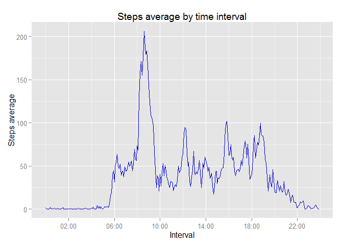

# Reproducible Research: Peer Assessment 1
Tony G. Bolaño  
May 2015  

Current document is the solution for assignment 1 of Coursera &laquo;Reproducible Research&raquo; by Johns Hopkins University Roger D. Peng, PhD, Jeff Leek, PhD, Brian Caffo, PhD.

This assignment makes use of data from a personal activity monitoring device. This device collects data at 5 minute intervals through out the day. The data consists of two months of data from an anonymous individual collected during the months of October and November, 2012 and include the number of steps taken in 5 minute intervals each day.

## Loading and preprocessing the data

First of all we unzip the data file, which extracts ```activity.csv``` file. If ```activity.csv``` exists it will be overwritten.

The scripts stops if no file ```activity.zip``` was found in working directory or it couldn't be unzipped.


```r
zipfile <- "activity.zip"
if (!file.exists(zipfile)) {
    stop ("No activity.zip zipped data file found on working directory")
}
tryCatch({
    unzip("activity.zip", overwrite = TRUE)
}, warning = function(war) {
    stop("Some warnings occur extracting file. Process has stopped.")
}, error = function(err) {
    stop("Error unzipping data file. Process has stopped.")
})
```

Once we have tha CSV file, we import its data into activity data.frame. We specify a data type for each column.


```r
activity <- read.csv("activity.csv", colClasses = c("integer", "Date", "integer"))
```

Now, we add a new column converting interval to a human readable time format:


```r
interval <- activity$interval
activity$human_interval <- sprintf("%02d:%02d", interval%/%100, interval%%100)
```

## What is mean total number of steps taken per day?

First we calculate total steps by day using ```aggregate``` function and plot an histogram with resulting data.frame.


```r
steps_by_day <- aggregate(steps ~ date, activity, sum)
require(ggplot2)
```

```
## Loading required package: ggplot2
```

```r
p <- ggplot(steps_by_day, aes(x = (steps)))
p <- p + labs( x = "Steps", y = "Count of days", title = "Histogram: Steps taken per day")
p <- p + geom_histogram(binwidth = 3000 ,aes(fill = ..count..))
p
```

 

And now calculate mean and median


```r
mean(steps_by_day$steps)
```

```
## [1] 10766.19
```

```r
median(steps_by_day$steps)
```

```
## [1] 10765
```

## What is the average daily activity pattern?

First we calculate the mean of steps on each five minutes interval. and draw a time series plot, marking the value of max. average steps at the top of the line.


```r
require(scales)
```

```
## Loading required package: scales
```

```r
int_avg <- aggregate(steps ~ human_interval, activity, mean)

p <- ggplot( int_avg, aes(x = strptime(human_interval, format="%H:%M"), y = steps)) + geom_line(colour = "#0000CC", aes(group = 1))
p <- p + labs(x = "Interval", y = "Steps average", title = "Steps average by time interval")
p <- p + scale_x_datetime(labels = date_format("%H:%M"),breaks = date_breaks("4 hour"))
p
```

 

With this data.frame we calculate max value for steps and which interval correspond to that value.


```r
maxavgint <- int_avg[which.max(int_avg$steps),]
maxavgint
```

```
##     human_interval    steps
## 104          08:35 206.1698
```

As you can see, the max average of steps is around **206** steps at **08:35** interval.


## Imputing missing values

My first look for missing values is through summary function. When applied to a data frame, the summary() function is essentially applied to each column, and the results for all columns are shown together. If there are any missing values (denoted by ```NA``` for a particular datum), it would also provide a count for them.


```r
summary(activity)
```

```
##      steps             date               interval      human_interval    
##  Min.   :  0.00   Min.   :2012-10-01   Min.   :   0.0   Length:17568      
##  1st Qu.:  0.00   1st Qu.:2012-10-16   1st Qu.: 588.8   Class :character  
##  Median :  0.00   Median :2012-10-31   Median :1177.5   Mode  :character  
##  Mean   : 37.38   Mean   :2012-10-31   Mean   :1177.5                     
##  3rd Qu.: 12.00   3rd Qu.:2012-11-15   3rd Qu.:1766.2                     
##  Max.   :806.00   Max.   :2012-11-30   Max.   :2355.0                     
##  NA's   :2304
```

But I want to embed the result into the text (inline) so I have to find another solution. It's a trivial one, We can use ```is.na``` function and ```sum``` the values (```TRUE``` is treated as 1 and ```FALSE``` is treated as 0).


```r
nacount <- sum(is.na(activity$steps))
nacount
```

```
## [1] 2304
```

After doing this we can embed inline and say that **There are 2304 missing values in the original data**.

To deal with misiing data we're going to create a new dataset that is equal to the original but with the missing data filled with the mean for that 5-minute interval.


```r
noNa <- activity
for (i in 1:nrow(noNa)) {
    if (is.na(noNa$steps[i])) {
        noNa$steps[i] <- int_avg[which(noNa$human_interval[i] == int_avg$human_interval),]$steps
    }
}
```

If we create an histogram similar to plot 1 and calculate mean and median


```r
steps_by_day <- aggregate(steps ~ date, noNa, sum)
p <- ggplot(steps_by_day, aes(x = (steps)))
p <- p + labs( x = "Steps (No NA's)", y = "Count of days", title = "Histogram: Steps taken per day (filling NA's)")
p <- p + geom_histogram(binwidth = 3000 ,aes(fill = ..count..))
p
```

-1.png) 


```r
mean(steps_by_day$steps)
```

```
## [1] 10766.19
```

```r
median(steps_by_day$steps)
```

```
## [1] 10766.19
```

We could see an increase number of days at central bar (around mean), but not specially remarkable.

## Are there differences in activity patterns between weekdays and weekends?

AS I'm in Sapin, first of all I'm going to change locale to help understand script code for week days.


```r
Sys.setlocale("LC_TIME","English")
```

```
## [1] "English_United States.1252"
```
Now we add a new factor column indicating if is weekday or weekend day
 

```r
noNa$weekdays <- factor(format(noNa$date, "%A"))
levels(noNa$weekdays) <- list(weekday = c("Nomday","Tuesday","Wednesday","Thursday","Friday"), weekend = c("Saturday","Sunday"))
```

And compare time series between two kind of days


