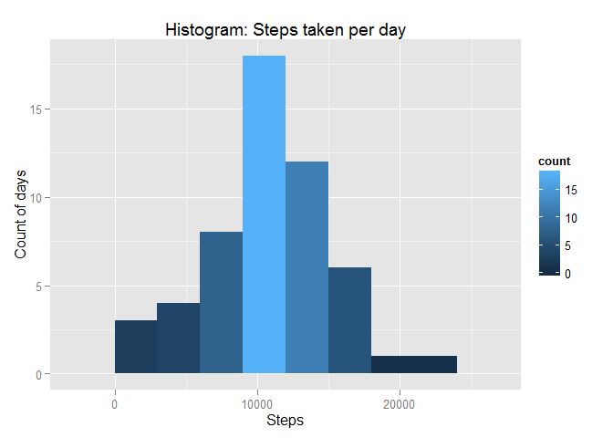

# Reproducible Research: Peer Assessment 1
Tony G. Bolaño  


## Loading and preprocessing the data

First of all we unzip the data file, which extracts ```activity.csv``` file. If ```activity.csv``` exists it will be overwritten.

The scripts stops if no file ```activity.zip``` was found in working directory or it couldn't be unzipped.


```r
zipfile <- "activity.zip"
if (!file.exists(zipfile)) {
    stop ("No activity.zip zipped data file found on working directory")
}
tryCatch({
    unzip("activity.zip", overwrite = TRUE)
}, warning = function(war) {
    stop("Some warnings occur extracting file. Process has stopped.")
}, error = function(err) {
    stop("Error unzipping data file. Process has stopped.")
})
```

Once we have tha CSV file, we import its data into activity data.frame.


```r
activity <- read.csv("activity.csv")
```


## What is mean total number of steps taken per day?

First we calculate total steps by day using ```aggregate``` function and plot an histogram with resulting data.frame.


```r
steps_by_day <- aggregate(steps ~ date, activity, sum)
library(ggplot2)
p <- ggplot(steps_by_day, aes(x = (steps)))
p <- p + labs( x = "Steps", y = "Count of days", title = "Histogram: Steps taken per day")
p <- p + geom_histogram(binwidth = 3000 ,aes(fill = ..count..))
p
```

 

And now calculate mean and median


```r
mean(steps_by_day$steps)
```

```
## [1] 10766.19
```

```r
median(steps_by_day$steps)
```

```
## [1] 10765
```

## What is the average daily activity pattern?

First we calculate the mean of steps on each five minutes interval. and draw a time series plot, marking the value of max. average steps at the top of the line.


```r
int_avg <- aggregate(steps ~ interval, activity, mean)

p <- ggplot( int_avg, aes(x = interval, y = steps)) + geom_line(colour = "#0000CC")
p <- p + labs(x = "Interval", y = "Steps average", title = "Steps average by time interval")
p
```

 

With this data.frame we calculate max value for steps and which interval correspond to that value.


```r
maxavg <- max(int_avg$steps)
maxint <- int_avg[int_avg$steps == maxavg,"interval"]
maxint
```

```
## [1] 835
```

As you can see, the max average of steps is around **206** steps at **835** interval.


## Imputing missing values


## Are there differences in activity patterns between weekdays and weekends?
